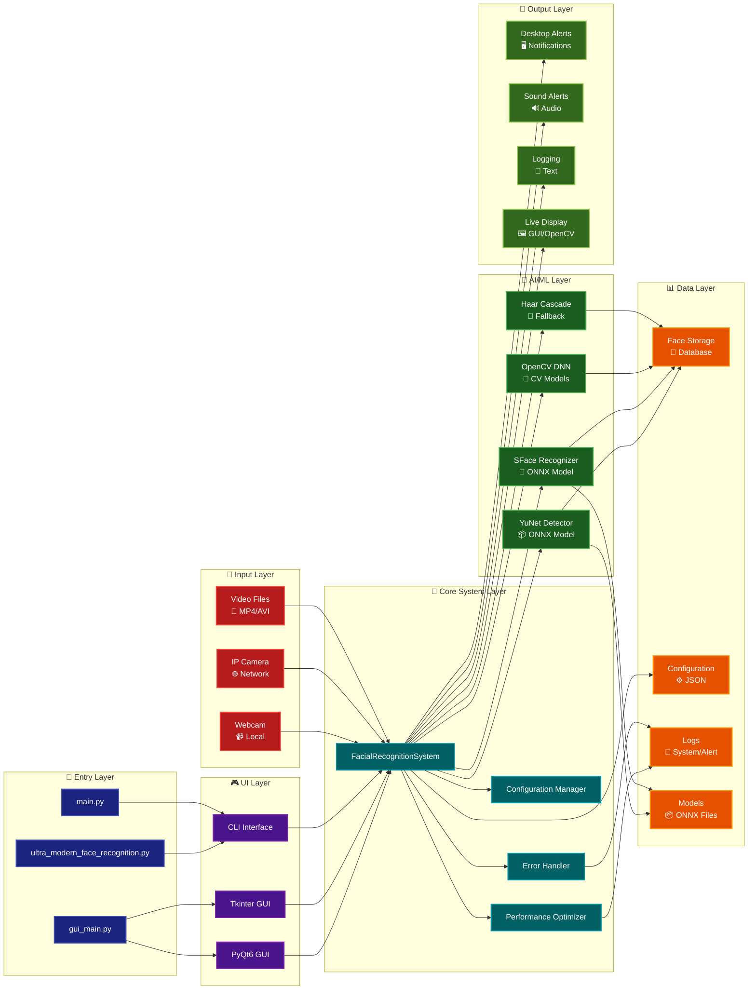
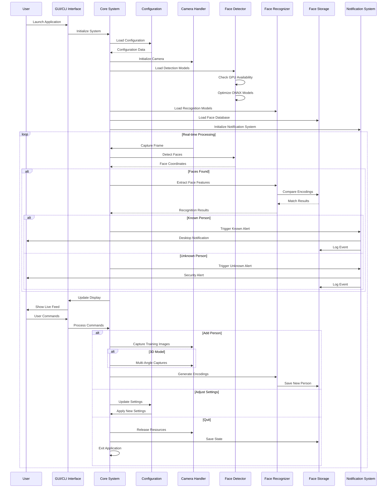

# 🔄 Ultra-Modern Facial Recognition System - Complete Architecture (2025)

## 📊 System Overview Flowchart

```mermaid
graph TB
    %% Entry Points
    START([👤 User Launch]) --> ENTRY{Entry Point?}
    ENTRY -->|gui_main.py| GUI[🖥️ GUI Interface]
    ENTRY -->|ultra_modern_face_recognition.py| CLI[💻 CLI Interface]
    ENTRY -->|main.py| LEGACY[🔙 Legacy Entry]
    
    %% Configuration Loading
    GUI --> CONFIG_LOAD[⚙️ Load Configuration]
    CLI --> CONFIG_LOAD
    LEGACY --> CONFIG_LOAD
    
    CONFIG_LOAD --> CONFIG_CHECK{Config Valid?}
    CONFIG_CHECK -->|Yes| SYSTEM_INIT[🏗️ Initialize System]
    CONFIG_CHECK -->|No| CONFIG_CREATE[📝 Create Default Config]
    CONFIG_CREATE --> SYSTEM_INIT
    
    %% UI Selection
    GUI --> UI_SELECT{UI Framework?}
    UI_SELECT -->|PyQt6 Available| PYQT[🎨 PyQt6 Interface]
    UI_SELECT -->|Fallback| TK[🧩 Tkinter Interface]
    
    %% Component Initialization
    SYSTEM_INIT --> COMP_INIT[🔧 Initialize Components]
    PYQT --> COMP_INIT
    TK --> COMP_INIT
    
    COMP_INIT --> CAMERA_INIT[📹 Camera Handler]
    COMP_INIT --> DETECTOR_INIT[🔍 Face Detector]
    COMP_INIT --> RECOGNIZER_INIT[🧠 Face Recognizer]
    COMP_INIT --> NOTIFIER_INIT[🚨 Notification System]
    COMP_INIT --> STORAGE_INIT[💾 Face Storage]
    
    %% Model Loading
    DETECTOR_INIT --> MODEL_LOAD[📦 Load Detection Models]
    RECOGNIZER_INIT --> ENCODE_LOAD[🗃️ Load Face Encodings]
    
    MODEL_LOAD --> MODEL_CHECK{Models Available?}
    MODEL_CHECK -->|YuNet| YUNET[🎯 YuNet Detector]
    MODEL_CHECK -->|OpenCV DNN| OPENCV_DNN[🔄 OpenCV DNN]
    MODEL_CHECK -->|Fallback| HAAR[📐 Haar Cascade]
    
    ENCODE_LOAD --> ENCODE_CHECK{Encodings Exist?}
    ENCODE_CHECK -->|Yes| LOAD_DB[📚 Load Face Database]
    ENCODE_CHECK -->|No| CREATE_DB[🆕 Create New Database]
    
    %% GPU Acceleration
    YUNET --> GPU_CHECK{GPU Available?}
    GPU_CHECK -->|Yes| ONNX_GPU[⚡ ONNX GPU Acceleration]
    GPU_CHECK -->|No| ONNX_CPU[🔄 ONNX CPU Execution]
    
    %% Main Processing Loop
    ONNX_GPU --> MAIN_LOOP[🔄 Main Processing Loop]
    ONNX_CPU --> MAIN_LOOP
    OPENCV_DNN --> MAIN_LOOP
    HAAR --> MAIN_LOOP
    LOAD_DB --> MAIN_LOOP
    CREATE_DB --> MAIN_LOOP
    
    %% Camera Processing
    MAIN_LOOP --> FRAME_CAPTURE[📸 Capture Frame]
    FRAME_CAPTURE --> FRAME_CHECK{Frame Valid?}
    FRAME_CHECK -->|No| FRAME_CAPTURE
    FRAME_CHECK -->|Yes| PREPROCESS[🔧 Preprocess Frame]
    
    PREPROCESS --> RESIZE[📏 Resize/Normalize]
    RESIZE --> COLOR_CONVERT[🎨 Color Conversion]
    COLOR_CONVERT --> FACE_DETECT[🔍 Face Detection]
    
    %% Face Detection Pipeline
    FACE_DETECT --> DETECT_ALGO{Detection Method?}
    DETECT_ALGO -->|YuNet| YUNET_DETECT[🎯 YuNet Detection]
    DETECT_ALGO -->|OpenCV| OPENCV_DETECT[🔄 OpenCV Detection]
    DETECT_ALGO -->|Haar| HAAR_DETECT[📐 Haar Detection]
    
    YUNET_DETECT --> FACE_FOUND{Faces Found?}
    OPENCV_DETECT --> FACE_FOUND
    HAAR_DETECT --> FACE_FOUND
    
    FACE_FOUND -->|No| DISPLAY_FRAME[🖥️ Display Frame]
    FACE_FOUND -->|Yes| FACE_EXTRACT[✂️ Extract Face Regions]
    
    %% Face Recognition Pipeline
    FACE_EXTRACT --> FACE_ALIGN[📐 Face Alignment]
    FACE_ALIGN --> ENCODE_FACE[🧬 Generate Encodings]
    
    ENCODE_FACE --> ENCODE_METHOD{Encoding Method?}
    ENCODE_METHOD -->|SFace| SFACE_ENCODE[🤖 SFace Model]
    ENCODE_METHOD -->|face_recognition| FR_ENCODE[🏷️ face_recognition Library]
    ENCODE_METHOD -->|Custom| CUSTOM_ENCODE[⚙️ Custom Encoding]
    
    SFACE_ENCODE --> COMPARE_FACES[🔍 Compare Encodings]
    FR_ENCODE --> COMPARE_FACES
    CUSTOM_ENCODE --> COMPARE_FACES
    
    COMPARE_FACES --> MATCH_CHECK{Match Found?}
    MATCH_CHECK -->|Yes| IDENTIFY_PERSON[👤 Identify Person]
    MATCH_CHECK -->|No| UNKNOWN_PERSON[❓ Unknown Person]
    
    %% Recognition Results
    IDENTIFY_PERSON --> CONFIDENCE_CHECK{Confidence > Threshold?}
    CONFIDENCE_CHECK -->|Yes| KNOWN_ALERT[✅ Known Person Alert]
    CONFIDENCE_CHECK -->|No| UNKNOWN_PERSON
    
    UNKNOWN_PERSON --> UNKNOWN_ALERT[⚠️ Unknown Person Alert]
    
    %% Alert System
    KNOWN_ALERT --> ALERT_PROCESS[🚨 Process Alert]
    UNKNOWN_ALERT --> ALERT_PROCESS
    
    ALERT_PROCESS --> ALERT_TYPE{Alert Type?}
    ALERT_TYPE -->|Desktop| DESKTOP_NOTIF[🖥️ Desktop Notification]
    ALERT_TYPE -->|Sound| SOUND_ALERT[🔊 Sound Alert]
    ALERT_TYPE -->|Log| LOG_ALERT[📝 Log Event]
    ALERT_TYPE -->|Custom| CUSTOM_ALERT[🌐 Custom Alert]
    
    %% Logging and Storage
    DESKTOP_NOTIF --> LOG_EVENT[📊 Log Event]
    SOUND_ALERT --> LOG_EVENT
    LOG_ALERT --> LOG_EVENT
    CUSTOM_ALERT --> LOG_EVENT
    
    LOG_EVENT --> UPDATE_DB[🗃️ Update Database]
    UPDATE_DB --> ANNOTATE_FRAME[🏷️ Annotate Frame]
    
    %% Display and Continuation
    ANNOTATE_FRAME --> DISPLAY_FRAME
    DISPLAY_FRAME --> PERFORMANCE[📊 Update Performance Metrics]
    PERFORMANCE --> USER_INPUT{User Input?}
    
    USER_INPUT -->|Continue| FRAME_CAPTURE
    USER_INPUT -->|Add Person| ADD_PERSON[➕ Add New Person]
    USER_INPUT -->|Settings| SETTINGS[⚙️ Adjust Settings]
    USER_INPUT -->|Quit| CLEANUP[🧹 Cleanup Resources]
    
    ADD_PERSON --> SIMPLE_OR_3D{Capture Type?}
    SIMPLE_OR_3D -->|Simple| CAPTURE_SIMPLE[📸 Single Capture]
    SIMPLE_OR_3D -->|3D Model| CAPTURE_3D[🧩 Multi-Angle Capture]
    
    CAPTURE_SIMPLE --> TRAIN_MODEL[🎓 Train/Update Model]
    CAPTURE_3D --> TRAIN_MODEL
    TRAIN_MODEL --> SAVE_DB[💾 Save Database]
    SAVE_DB --> FRAME_CAPTURE
    
    SETTINGS --> CONFIG_UPDATE[⚙️ Update Configuration]
    CONFIG_UPDATE --> FRAME_CAPTURE
    
    CLEANUP --> STOP([🛑 System Stop])
    
    %% Styling - Dark Mode Friendly
    classDef entryPoint fill:#1a237e,stroke:#3f51b5,stroke-width:2px,color:#ffffff
    classDef processing fill:#4a148c,stroke:#7b1fa2,stroke-width:2px,color:#ffffff
    classDef detection fill:#1b5e20,stroke:#4caf50,stroke-width:2px,color:#ffffff
    classDef recognition fill:#e65100,stroke:#ff9800,stroke-width:2px,color:#ffffff
    classDef alert fill:#b71c1c,stroke:#f44336,stroke-width:2px,color:#ffffff
    classDef storage fill:#33691e,stroke:#8bc34a,stroke-width:2px,color:#ffffff
    
    class START,ENTRY,GUI,CLI,LEGACY entryPoint
    class COMP_INIT,PREPROCESS,RESIZE,COLOR_CONVERT processing
    class FACE_DETECT,YUNET_DETECT,OPENCV_DETECT,HAAR_DETECT detection
    class ENCODE_FACE,SFACE_ENCODE,FR_ENCODE,COMPARE_FACES recognition
    class ALERT_PROCESS,DESKTOP_NOTIF,SOUND_ALERT,CUSTOM_ALERT alert
    class LOG_EVENT,UPDATE_DB,SAVE_DB storage
```

## 🏗️ Modernized System Architecture Diagram

```mermaid
graph LR
    subgraph "🎯 Entry Layer"
        A[gui_main.py]
        B[ultra_modern_face_recognition.py]
        C[main.py]
    end
    
    subgraph "🎮 UI Layer"
        D[PyQt6 GUI]
        E[Tkinter GUI]
        F[CLI Interface]
    end
    
    subgraph "🔧 Core System Layer"
        G[FacialRecognitionSystem]
        H[Configuration Manager]
        I[Performance Optimizer]
        J[Error Handler]
    end
    
    subgraph "🧠 AI/ML Layer"
        K[YuNet Detector<br/>📦 ONNX Model]
        L[SFace Recognizer<br/>🤖 ONNX Model]
        M[OpenCV DNN<br/>🔄 CV Models]
        N[Haar Cascade<br/>📏 Fallback]
    end
    
    subgraph "📊 Data Layer"
        O[Face Storage<br/>💾 Database]
        P[Configuration<br/>⚙️ JSON]
        Q[Logs<br/>📝 System/Alert]
        R[Models<br/>📦 ONNX Files]
    end
    
    subgraph "🎥 Input Layer"
        S[Webcam<br/>📹 Local]
        T[IP Camera<br/>🌐 Network]
        U[Video Files<br/>📼 MP4/AVI]
    end
    
    subgraph "🚨 Output Layer"
        V[Desktop Alerts<br/>🖥️ Notifications]
        W[Sound Alerts<br/>🔊 Audio]
        X[Logging<br/>📝 Text]
        Y[Live Display<br/>🖼️ GUI/OpenCV]
    end
    
    %% Connections
    A --> D
    A --> E
    B --> F
    C --> F
    
    D --> G
    E --> G
    F --> G
    
    G --> H
    G --> I
    G --> J
    
    G --> K
    G --> L
    G --> M
    G --> N
    
    K --> O
    L --> O
    M --> O
    N --> O
    
    G --> P
    I --> Q
    J --> Q
    K --> R
    L --> R
    
    S --> G
    T --> G
    U --> G
    
    G --> V
    G --> W
    G --> X
    G --> Y
    
    %% Styling - Dark Mode Friendly
    classDef entry fill:#1a237e,stroke:#3f51b5,stroke-width:2px,color:#ffffff
    classDef ui fill:#4a148c,stroke:#7b1fa2,stroke-width:2px,color:#ffffff
    classDef core fill:#006064,stroke:#0097a7,stroke-width:2px,color:#ffffff
    classDef ai fill:#1b5e20,stroke:#4caf50,stroke-width:2px,color:#ffffff
    classDef data fill:#e65100,stroke:#ff9800,stroke-width:2px,color:#ffffff
    classDef input fill:#b71c1c,stroke:#f44336,stroke-width:2px,color:#ffffff
    classDef output fill:#33691e,stroke:#8bc34a,stroke-width:2px,color:#ffffff
    
    class A,B,C entry
    class D,E,F ui
    class G,H,I,J core
    class K,L,M,N ai
    class O,P,Q,R data
    class S,T,U input
    class V,W,X,Y output
```

## 🔄 Modern Data Flow Diagram

```mermaid
sequenceDiagram
    participant User
    participant GUI as GUI/CLI Interface
    participant System as Core System
    participant Config as Configuration
    participant Camera as Camera Handler
    participant Detector as Face Detector
    participant Recognizer as Face Recognizer
    participant Database as Face Storage
    participant Notifier as Notification System
    
    User->>GUI: Launch Application
    GUI->>System: Initialize System
    System->>Config: Load Configuration
    Config-->>System: Configuration Data
    
    System->>Camera: Initialize Camera
    System->>Detector: Load Detection Models
    Detector->>Detector: Check GPU Availability
    Detector->>Detector: Optimize ONNX Models
    System->>Recognizer: Load Recognition Models
    System->>Database: Load Face Database
    System->>Notifier: Initialize Notification System
    
    loop Real-time Processing
        Camera->>System: Capture Frame
        System->>Detector: Detect Faces
        Detector-->>System: Face Coordinates
        
        alt Faces Found
            System->>Recognizer: Extract Face Features
            Recognizer->>Database: Compare Encodings
            Database-->>Recognizer: Match Results
            Recognizer-->>System: Recognition Results
            
            alt Known Person
                System->>Notifier: Trigger Known Alert
                Notifier->>User: Desktop Notification
                Notifier->>Database: Log Event
            else Unknown Person
                System->>Notifier: Trigger Unknown Alert
                Notifier->>User: Security Alert
                Notifier->>Database: Log Event
            end
        end
        
        System->>GUI: Update Display
        GUI->>User: Show Live Feed
        
        User->>GUI: User Commands
        GUI->>System: Process Commands
        
        alt Add Person
            System->>Camera: Capture Training Images
            alt 3D Model
                System->>Camera: Multi-Angle Captures
            end
            System->>Recognizer: Generate Encodings
            Recognizer->>Database: Save New Person
        else Adjust Settings
            System->>Config: Update Settings
            Config->>System: Apply New Settings
        else Quit
            System->>Camera: Release Resources
            System->>Database: Save State
            System->>System: Exit Application
        end
    end
```

## 📁 Modernized Component Breakdown

### 🎯 **Entry Points**
- **gui_main.py**: Primary GUI entry point with PyQt6/Tkinter
- **ultra_modern_face_recognition.py**: CLI-based full-featured interface
- **main.py**: Legacy entry point for backward compatibility

### 🎮 **UI Components**
- **PyQt6 GUI**: Modern graphical interface with rich components
- **Tkinter GUI**: Fallback GUI for systems without PyQt6
- **CLI Interface**: Terminal-based interface with rich text formatting

### 🔧 **Core System**
- **FacialRecognitionSystem**: Primary orchestrator of all components
- **Configuration Manager**: Settings and parameter management
- **Performance Optimizer**: System performance monitoring and tuning
- **Error Handler**: Comprehensive exception management

### 🧠 **AI/ML Components**
- **YuNet**: State-of-the-art face detection (ONNX)
- **SFace**: Advanced face recognition (ONNX)
- **OpenCV DNN**: Traditional computer vision models
- **Haar Cascade**: Fallback detection for compatibility

### 📊 **Data Management**
- **Face Storage**: Efficient database for face encodings
- **Configuration**: JSON-based settings storage
- **Logging**: Comprehensive event and error logging
- **Model Files**: ONNX model weights management

### 🔄 **Processing Pipeline**
1. **Input Capture**: Multi-source video input handling
2. **Preprocessing**: Frame normalization and enhancement
3. **Face Detection**: Multiple algorithm support with fallbacks
4. **Feature Extraction**: Advanced encoding methods with SFace
5. **Recognition**: Cosine similarity matching with thresholds
6. **Database Updates**: Real-time learning and updates
7. **Notification**: Multi-channel alerting system

### 🚨 **Alert Mechanisms**
- **Desktop Notifications**: System-level popup alerts
- **Sound Alerts**: Configurable audio feedback
- **Logging**: Comprehensive event recording
- **Visual Indicators**: Real-time UI feedback

## 🔧 **Performance Optimizations**
- **ONNX Runtime Acceleration**: Hardware-specific optimizations
- **GPU Acceleration**: CUDA support for detection and recognition
- **Frame Buffering**: Smooth video handling with queues
- **Model Caching**: Fast inference with cached models
- **Asynchronous Processing**: Non-blocking operations for UI responsiveness
- **Adaptive Frame Processing**: Dynamic frame rate based on system load

## 🧩 **Key System Modules**

### src/face_recognition/core/
- **system.py**: Main system controller and orchestration
- **face_detector.py**: Face detection algorithms and pipeline
- **face_recognizer.py**: Recognition and feature extraction
- **face_storage.py**: Database and persistence management

### src/face_recognition/ui/
- **qt_gui.py**: PyQt6-based graphical interface
- **tk_gui.py**: Tkinter-based fallback interface
- **ui_components.py**: Shared UI components and utilities
- **settings_dialogs.py**: Configuration interface elements

### src/face_recognition/utils/
- **managers.py**: Resource and component management
- **notification_settings.py**: Alert configuration and delivery
- **onnx_helper.py**: ONNX runtime optimization utilities

### src/face_recognition/models/
- **face_models.py**: Model definitions and wrappers

## 📈 **System Diagnostics & Maintenance**

- **cuda_setup.py**: GPU configuration and verification
- **diagnose_onnx.py**: ONNX runtime diagnostics
- **fix_onnx_cuda.py**: CUDA-ONNX compatibility fixes
- **optimize_performance.py**: System-wide performance tuning
- **test_cuda.py**: CUDA functionality verification
- **test_onnx.py**: ONNX model validation
- **cleanup.py**: System maintenance and cleanup

This flowchart represents the complete architecture of the Ultra-Modern Face Recognition System, showing all components from initialization through processing to output generation and system maintenance.
