# 🔄 Facial Recognition System - Complete Workflow & Architecture

## 📊 System Overview Flowchart

```mermaid
graph TB
    %% Entry Points
    START([👤 User Launch]) --> ENTRY{Entry Point?}
    ENTRY -->|main.py| MAIN[📋 Main Entry Point]
    ENTRY -->|launcher.py| LAUNCHER[🚀 Launcher]
    ENTRY -->|CLI Scripts| CLI[💻 CLI Interface]
    
    %% Configuration Loading
    MAIN --> CONFIG_LOAD[⚙️ Load Configuration]
    LAUNCHER --> CONFIG_LOAD
    CLI --> CONFIG_LOAD
    
    CONFIG_LOAD --> CONFIG_CHECK{Config Valid?}
    CONFIG_CHECK -->|Yes| SYSTEM_INIT[🏗️ Initialize System]
    CONFIG_CHECK -->|No| CONFIG_CREATE[📝 Create Default Config]
    CONFIG_CREATE --> SYSTEM_INIT
    
    %% System Selection
    SYSTEM_INIT --> SYSTEM_SELECT{System Type?}
    SYSTEM_SELECT -->|Enhanced| ENHANCED[🚀 Enhanced System]
    SYSTEM_SELECT -->|Professional| PROFESSIONAL[💼 Professional System]
    SYSTEM_SELECT -->|Legacy| LEGACY[📟 Legacy System]
    
    %% Component Initialization
    ENHANCED --> COMP_INIT[🔧 Initialize Components]
    PROFESSIONAL --> COMP_INIT
    LEGACY --> COMP_INIT
    
    COMP_INIT --> CAMERA_INIT[📹 Camera Handler]
    COMP_INIT --> DETECTOR_INIT[🔍 Face Detector]
    COMP_INIT --> RECOGNIZER_INIT[🧠 Face Recognizer]
    COMP_INIT --> ALERT_INIT[🚨 Alert System]
    
    %% Model Loading
    DETECTOR_INIT --> MODEL_LOAD[📦 Load Detection Models]
    RECOGNIZER_INIT --> ENCODE_LOAD[🗃️ Load Face Encodings]
    
    MODEL_LOAD --> MODEL_CHECK{Models Available?}
    MODEL_CHECK -->|YuNet| YUNET[🎯 YuNet Detector]
    MODEL_CHECK -->|OpenCV DNN| OPENCV_DNN[🔄 OpenCV DNN]
    MODEL_CHECK -->|Haar Cascade| HAAR[📐 Haar Cascade]
    MODEL_CHECK -->|dlib| DLIB[🔍 dlib Detector]
    
    ENCODE_LOAD --> ENCODE_CHECK{Encodings Exist?}
    ENCODE_CHECK -->|Yes| LOAD_DB[📚 Load Face Database]
    ENCODE_CHECK -->|No| CREATE_DB[🆕 Create New Database]
    
    %% Main Processing Loop
    YUNET --> MAIN_LOOP[🔄 Main Processing Loop]
    OPENCV_DNN --> MAIN_LOOP
    HAAR --> MAIN_LOOP
    DLIB --> MAIN_LOOP
    LOAD_DB --> MAIN_LOOP
    CREATE_DB --> MAIN_LOOP
    
    %% Camera Processing
    MAIN_LOOP --> FRAME_CAPTURE[📸 Capture Frame]
    FRAME_CAPTURE --> FRAME_CHECK{Frame Valid?}
    FRAME_CHECK -->|No| FRAME_CAPTURE
    FRAME_CHECK -->|Yes| PREPROCESS[🔧 Preprocess Frame]
    
    PREPROCESS --> RESIZE[📏 Resize/Normalize]
    RESIZE --> COLOR_CONVERT[🎨 Color Conversion]
    COLOR_CONVERT --> FACE_DETECT[🔍 Face Detection]
    
    %% Face Detection Pipeline
    FACE_DETECT --> DETECT_ALGO{Detection Method?}
    DETECT_ALGO -->|YuNet| YUNET_DETECT[🎯 YuNet Detection]
    DETECT_ALGO -->|OpenCV| OPENCV_DETECT[🔄 OpenCV Detection]
    DETECT_ALGO -->|dlib| DLIB_DETECT[🔍 dlib Detection]
    
    YUNET_DETECT --> FACE_FOUND{Faces Found?}
    OPENCV_DETECT --> FACE_FOUND
    DLIB_DETECT --> FACE_FOUND
    
    FACE_FOUND -->|No| DISPLAY_FRAME[🖥️ Display Frame]
    FACE_FOUND -->|Yes| FACE_EXTRACT[✂️ Extract Face Regions]
    
    %% Face Recognition Pipeline
    FACE_EXTRACT --> FACE_ALIGN[📐 Face Alignment]
    FACE_ALIGN --> ENCODE_FACE[🧬 Generate Encodings]
    
    ENCODE_FACE --> ENCODE_METHOD{Encoding Method?}
    ENCODE_METHOD -->|face_recognition| FR_ENCODE[🏷️ face_recognition Library]
    ENCODE_METHOD -->|SFace| SFACE_ENCODE[🤖 SFace Model]
    ENCODE_METHOD -->|Custom| CUSTOM_ENCODE[⚙️ Custom Encoding]
    
    FR_ENCODE --> COMPARE_FACES[🔍 Compare Encodings]
    SFACE_ENCODE --> COMPARE_FACES
    CUSTOM_ENCODE --> COMPARE_FACES
    
    COMPARE_FACES --> MATCH_CHECK{Match Found?}
    MATCH_CHECK -->|Yes| IDENTIFY_PERSON[👤 Identify Person]
    MATCH_CHECK -->|No| UNKNOWN_PERSON[❓ Unknown Person]
    
    %% Recognition Results
    IDENTIFY_PERSON --> CONFIDENCE_CHECK{Confidence > Threshold?}
    CONFIDENCE_CHECK -->|Yes| KNOWN_ALERT[✅ Known Person Alert]
    CONFIDENCE_CHECK -->|No| UNKNOWN_PERSON
    
    UNKNOWN_PERSON --> UNKNOWN_ALERT[⚠️ Unknown Person Alert]
    
    %% Alert System
    KNOWN_ALERT --> ALERT_PROCESS[🚨 Process Alert]
    UNKNOWN_ALERT --> ALERT_PROCESS
    
    ALERT_PROCESS --> ALERT_TYPE{Alert Type?}
    ALERT_TYPE -->|Desktop| DESKTOP_NOTIF[🖥️ Desktop Notification]
    ALERT_TYPE -->|Sound| SOUND_ALERT[🔊 Sound Alert]
    ALERT_TYPE -->|Log| LOG_ALERT[📝 Log Event]
    ALERT_TYPE -->|Webhook| WEBHOOK_ALERT[🌐 Webhook Alert]
    ALERT_TYPE -->|Email| EMAIL_ALERT[📧 Email Alert]
    
    %% Logging and Storage
    DESKTOP_NOTIF --> LOG_EVENT[📊 Log Event]
    SOUND_ALERT --> LOG_EVENT
    LOG_ALERT --> LOG_EVENT
    WEBHOOK_ALERT --> LOG_EVENT
    EMAIL_ALERT --> LOG_EVENT
    
    LOG_EVENT --> UPDATE_DB[🗃️ Update Database]
    UPDATE_DB --> ANNOTATE_FRAME[🏷️ Annotate Frame]
    
    %% Display and Continuation
    ANNOTATE_FRAME --> DISPLAY_FRAME
    DISPLAY_FRAME --> PERFORMANCE[📊 Update Performance Metrics]
    PERFORMANCE --> USER_INPUT{User Input?}
    
    USER_INPUT -->|Continue| FRAME_CAPTURE
    USER_INPUT -->|Add Person| ADD_PERSON[➕ Add New Person]
    USER_INPUT -->|Settings| SETTINGS[⚙️ Adjust Settings]
    USER_INPUT -->|Quit| CLEANUP[🧹 Cleanup Resources]
    
    ADD_PERSON --> CAPTURE_SAMPLES[📸 Capture Face Samples]
    CAPTURE_SAMPLES --> TRAIN_MODEL[🎓 Train/Update Model]
    TRAIN_MODEL --> SAVE_DB[💾 Save Database]
    SAVE_DB --> FRAME_CAPTURE
    
    SETTINGS --> CONFIG_UPDATE[⚙️ Update Configuration]
    CONFIG_UPDATE --> FRAME_CAPTURE
    
    CLEANUP --> STOP([🛑 System Stop])
    
    %% Styling - Dark Mode Friendly
    classDef entryPoint fill:#1a237e,stroke:#3f51b5,stroke-width:2px,color:#ffffff
    classDef processing fill:#4a148c,stroke:#7b1fa2,stroke-width:2px,color:#ffffff
    classDef detection fill:#1b5e20,stroke:#4caf50,stroke-width:2px,color:#ffffff
    classDef recognition fill:#e65100,stroke:#ff9800,stroke-width:2px,color:#ffffff
    classDef alert fill:#b71c1c,stroke:#f44336,stroke-width:2px,color:#ffffff
    classDef storage fill:#33691e,stroke:#8bc34a,stroke-width:2px,color:#ffffff
    
    class START,ENTRY,MAIN,LAUNCHER,CLI entryPoint
    class COMP_INIT,PREPROCESS,RESIZE,COLOR_CONVERT processing
    class FACE_DETECT,YUNET_DETECT,OPENCV_DETECT,DLIB_DETECT detection
    class ENCODE_FACE,FR_ENCODE,SFACE_ENCODE,COMPARE_FACES recognition
    class ALERT_PROCESS,DESKTOP_NOTIF,SOUND_ALERT,WEBHOOK_ALERT alert
    class LOG_EVENT,UPDATE_DB,SAVE_DB storage
```

## 🏗️ System Architecture Diagram

```mermaid
graph LR
    subgraph "🎯 Entry Layer"
        A[main.py]
        B[launcher.py]
        C[CLI Scripts]
    end
    
    subgraph "🔧 Core System Layer"
        D[Enhanced System]
        E[Professional System]
        F[Legacy System]
        G[Configuration Manager]
    end
    
    subgraph "🧠 AI/ML Layer"
        H[YuNet Detector<br/>📦 ONNX Model]
        I[SFace Recognizer<br/>🤖 ONNX Model]
        J[OpenCV DNN<br/>🔄 CV Models]
        K[dlib Models<br/>🔍 HOG/CNN]
        L[face_recognition<br/>🏷️ Library]
    end
    
    subgraph "📊 Data Layer"
        M[Face Database<br/>📚 PKL/JSON]
        N[Configuration<br/>⚙️ YAML/JSON]
        O[Logs<br/>📝 System/Alert]
        P[Models<br/>📦 ONNX Files]
    end
    
    subgraph "🎥 Input Layer"
        Q[Webcam<br/>📹 Local]
        R[IP Camera<br/>🌐 Network]
        S[Video Files<br/>📼 MP4/AVI]
        T[RTSP Streams<br/>📡 Network]
    end
    
    subgraph "🚨 Output Layer"
        U[Desktop Alerts<br/>🖥️ Notifications]
        V[Sound Alerts<br/>🔊 Audio]
        W[Webhooks<br/>🌐 HTTP]
        X[Email Alerts<br/>📧 SMTP]
        Y[Live Display<br/>🖼️ OpenCV]
    end
    
    %% Connections
    A --> G
    B --> G
    C --> G
    G --> D
    G --> E
    G --> F
    
    D --> H
    D --> I
    E --> J
    E --> K
    F --> L
    
    H --> M
    I --> M
    J --> M
    K --> M
    L --> M
    
    G --> N
    D --> O
    H --> P
    I --> P
    
    Q --> D
    R --> D
    S --> E
    T --> E
    
    D --> U
    D --> V
    E --> W
    E --> X
    F --> Y
    
    %% Styling - Dark Mode Friendly
    classDef entry fill:#1a237e,stroke:#3f51b5,stroke-width:2px,color:#ffffff
    classDef core fill:#4a148c,stroke:#7b1fa2,stroke-width:2px,color:#ffffff
    classDef ai fill:#1b5e20,stroke:#4caf50,stroke-width:2px,color:#ffffff
    classDef data fill:#e65100,stroke:#ff9800,stroke-width:2px,color:#ffffff
    classDef input fill:#b71c1c,stroke:#f44336,stroke-width:2px,color:#ffffff
    classDef output fill:#33691e,stroke:#8bc34a,stroke-width:2px,color:#ffffff
    
    class A,B,C entry
    class D,E,F,G core
    class H,I,J,K,L ai
    class M,N,O,P data
    class Q,R,S,T input
    class U,V,W,X,Y output
```

## 🔄 Data Flow Diagram

## 📁 Component Breakdown

### 🎯 **Core Components**
- **Enhanced Main System**: Primary orchestrator with advanced features
- **Professional System**: Enterprise-grade processing pipeline
- **Legacy System**: Backward compatibility support
- **Configuration Manager**: Centralized settings management

### 🤖 **AI/ML Models**
- **YuNet**: SOTA face detection (ONNX)
- **SFace**: Advanced face recognition (ONNX)
- **OpenCV DNN**: Traditional computer vision
- **dlib**: HOG/CNN face detection
- **face_recognition**: Python library wrapper

### 📊 **Data Management**
- **Face Database**: Pickle/JSON storage
- **Model Files**: ONNX model weights
- **Configuration**: YAML/JSON settings
- **Logging**: System and alert logs

### 🔄 **Processing Pipeline**
1. **Input Capture**: Multi-source video input
2. **Preprocessing**: Frame normalization
3. **Face Detection**: Multiple algorithm support
4. **Feature Extraction**: Advanced encoding methods
5. **Recognition**: Similarity matching
6. **Alert Processing**: Multi-channel notifications
7. **Database Updates**: Real-time learning

### 🚨 **Alert Mechanisms**
- **Desktop Notifications**: System-level alerts
- **Sound Alerts**: Audio feedback
- **Webhooks**: HTTP API integration
- **Email Alerts**: SMTP notifications
- **Live Display**: Real-time visualization

## 🔧 **Performance Optimizations**
- **Multi-threading**: Parallel processing
- **Frame Buffering**: Smooth video handling
- **Model Caching**: Fast inference
- **GPU Acceleration**: CUDA support
- **Asynchronous Processing**: Non-blocking operations

This flowchart represents the complete architecture of your facial recognition system, showing how all components interact from initialization through real-time processing to alert generation and data management.
